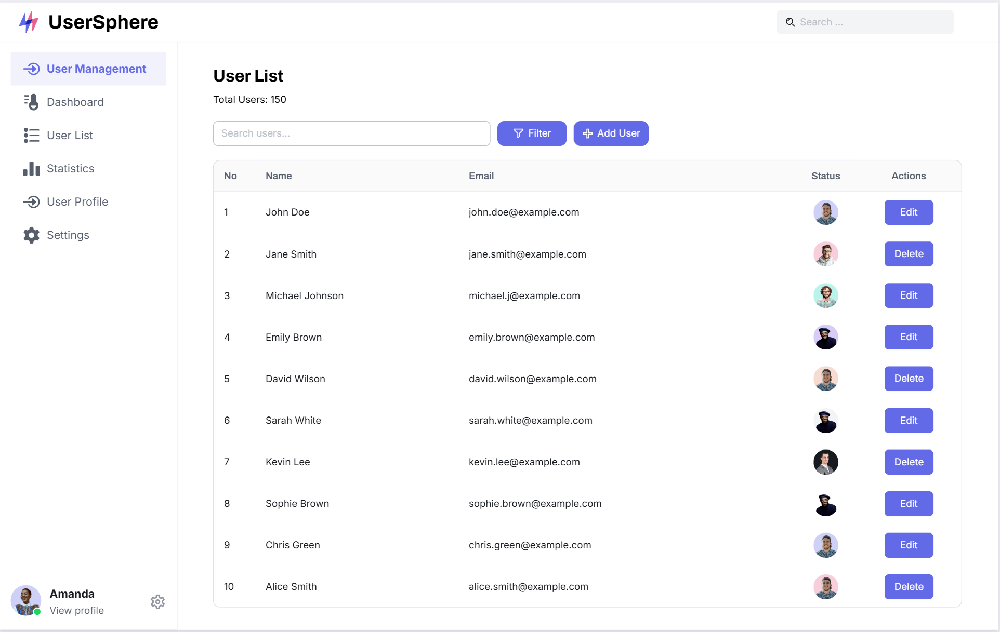

# UserSphere

UserSphere is the **frontend** of a full-stack CRM project, developed as part of a portfolio showcase. Built with **Angular**, **Material Design**, and **RxJS**, it offers role-based dashboards for **administrators** and **regular users**. This CRM provides functionality for managing users, profile settings, and displaying insightful statistics.

The backend for this project is available at: [auth-api-test](https://github.com/mariokreitz/auth-api-test).

## 🚀 Features

### Admin Dashboard

- Manage users (CRUD functionality).
- View user statistics and analytics.
- Profile management and settings.

### Regular User Dashboard

- Manage personal profile settings.
- View user-specific dashboard data.

### Authentication

- User registration with email verification.
- Password reset functionality.
- Secure session-based authentication via cookies.

## 🖼️ Screenshot



## 🛠️ Tech Stack

- **Angular**: The framework that powers the frontend.
- **Material Design**: UI components for an intuitive and responsive design.
- **RxJS**: Reactive programming for seamless data flow and state management.

## 📥 Setup

Follow these steps to get started with the project:

1. Clone the repository:
   ```bash
   git clone https://github.com/mariokreitz/UserSphere.git
   ```
2. Navigate to the project directory:
   ```bash
   cd UserSphere
   ```
3. Install the required dependencies:
   ```bash
   npm install
   ```
4. Run the application:
   ```bash
   ng serve
   ```
5. Open your browser and visit: `http://localhost:4200/`.

## 🌍 Deployment

Deployment is **TBA**.

## 📜 License

This project is licensed under the **MIT License**.

## 🚧 Roadmap

- Implement more detailed user statistics and analytics for admin dashboards.
- Add multi-language support for a global user base.
- Create a demo mode to showcase the app’s features with sample data.
- Optimize the app for mobile responsiveness and enhance the user experience on smaller devices.
- Further improve both admin and user dashboards.
- Generate comprehensive project documentation with **Compodoc** for better maintainability and developer understanding.
